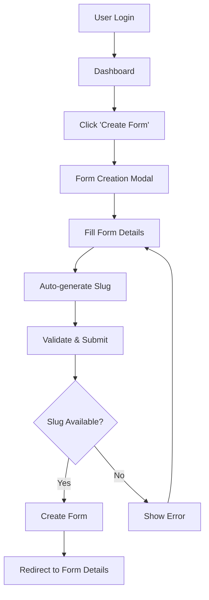

# Form Management Analysis & Critical Issue Resolution

## Table of Contents
- [Overview](#overview)
- [Current Architecture](#current-architecture)
- [Form Creation Workflow](#form-creation-workflow)
- [Critical Issue: Global Slug Conflicts](#critical-issue-global-slug-conflicts)
- [Detailed Solutions](#detailed-solutions)
- [Deep Dive: UUID-Based Form URLs](#deep-dive-uuid-based-form-urls)
- [Solution Comparison Matrix](#solution-comparison-matrix)
- [Recommendation](#recommendation)
- [Implementation Guide](#implementation-guide)
- [Additional Considerations](#additional-considerations)

## Overview

Form Service is a Next.js-based application that provides a Formspree-like service for creating and managing forms with email notifications. This document analyzes the current form management system and identifies a critical design flaw that affects user experience and platform scalability.

**Key Technologies:**
- **Frontend**: Next.js 15 with App Router
- **Database**: PostgreSQL via Supabase
- **Authentication**: Supabase Auth (Magic Links)
- **Styling**: Tailwind CSS
- **Email**: SendGrid integration

## Current Architecture

### Database Schema

#### Forms Table
```sql
CREATE TABLE public.forms (
  id UUID DEFAULT gen_random_uuid() PRIMARY KEY,
  user_id UUID NOT NULL REFERENCES auth.users(id) ON DELETE CASCADE,
  name VARCHAR(255) NOT NULL,
  slug VARCHAR(255) NOT NULL UNIQUE, -- ⚠️ GLOBAL UNIQUE CONSTRAINT
  description TEXT,
  email_notifications BOOLEAN DEFAULT true,
  notification_email VARCHAR(255),
  is_active BOOLEAN DEFAULT true,
  created_at TIMESTAMP WITH TIME ZONE DEFAULT NOW(),
  updated_at TIMESTAMP WITH TIME ZONE DEFAULT NOW(),
  
  CONSTRAINT forms_slug_format CHECK (slug ~ '^[a-z0-9-]+$')
);
```

#### Submissions Table
```sql
CREATE TABLE public.submissions (
  id UUID DEFAULT gen_random_uuid() PRIMARY KEY,
  form_id UUID NOT NULL REFERENCES public.forms(id) ON DELETE CASCADE,
  data JSONB NOT NULL,
  submitted_at TIMESTAMP WITH TIME ZONE DEFAULT NOW(),
  ip_address INET,
  user_agent TEXT,
  referrer TEXT
);
```

### Security Model

The application implements Row Level Security (RLS) with proper user isolation:

- **Form Access**: Users can only view/modify their own forms
- **Submission Access**: Users can only view submissions for their own forms
- **Public Submissions**: Anyone can submit to active forms via public API

### API Endpoints

| Method | Endpoint | Purpose | Access |
|--------|----------|---------|---------|
| `GET` | `/api/forms` | List user's forms | Authenticated |
| `POST` | `/api/forms` | Create new form | Authenticated |
| `GET` | `/api/forms/[slug]` | Get specific form | Authenticated |
| `PUT` | `/api/forms/[slug]` | Update form | Authenticated |
| `DELETE` | `/api/forms/[slug]` | Delete form | Authenticated |
| `POST` | `/api/forms/[slug]/submit` | Submit to form | Public |

## Form Creation Workflow

### 1. User Interface Flow


### 2. Slug Generation Logic
```typescript
export function generateSlug(name: string): string {
  return name
    .toLowerCase()
    .replace(/[^a-z0-9\s-]/g, '') // Remove special characters
    .replace(/\s+/g, '-')         // Replace spaces with hyphens
    .replace(/-+/g, '-')          // Replace multiple hyphens with single
    .replace(/^-|-$/g, '')        // Remove leading/trailing hyphens
}
```

### 3. Form Usage
External websites integrate forms using simple HTML:
```html
<form action="https://your-domain.com/api/forms/contact-form/submit" method="POST">
  <input name="name" placeholder="Your Name" required />
  <input name="email" type="email" placeholder="Email" required />
  <textarea name="message" placeholder="Message" required></textarea>
  <button type="submit">Send Message</button>
</form>
```

## Critical Issue: Global Slug Conflicts

### 🚨 The Problem

The current implementation has a **fundamental design flaw**: form slugs are globally unique across all users, not per-user unique.

```sql
-- Current problematic constraint
slug VARCHAR(255) NOT NULL UNIQUE
```

### Impact Analysis

#### 1. **User Experience Issues**
- User A creates form with slug "contact-form"
- User B tries to create "Contact Form" → gets error "A form with this URL already exists"
- User B has no form with that name but cannot use common form names

#### 2. **Scalability Problems**
- Popular form names get "reserved" by first users
- Common slugs like `contact`, `feedback`, `newsletter` become unavailable
- Users forced to use awkward naming conventions

#### 3. **Business Impact**
- User frustration and potential abandonment
- Limits platform growth potential
- Poor user experience compared to competitors

### Code Evidence

```typescript
// src/lib/database/forms.ts - Lines 150-158
const { data: existingForm } = await supabase
  .from('forms')
  .select('id')
  .eq('slug', formData.slug)  // ❌ No user_id filter!
  .single()

if (existingForm) {
  throw new Error('A form with this slug already exists')
}
```

The validation checks slug existence globally, not per-user.

## Detailed Solutions

### Solution 1: Per-User Slug Uniqueness (Recommended) ⭐

**Concept**: Make slugs unique per user, not globally.

#### Database Migration
```sql
-- Step 1: Remove global unique constraint
ALTER TABLE public.forms DROP CONSTRAINT forms_slug_key;

-- Step 2: Add composite unique constraint
ALTER TABLE public.forms ADD CONSTRAINT forms_user_slug_unique 
UNIQUE (user_id, slug);

-- Step 3: Update index for performance
CREATE INDEX idx_forms_user_slug ON public.forms(user_id, slug);
```

#### Code Changes
```typescript
// Update validation in src/lib/database/forms.ts
export async function createForm(formData: FormInsert): Promise<Form> {
  const supabase = await createClient()
  
  // Validate the form data
  const validation = validateForm(formData)
  if (!validation.isValid) {
    throw new Error(`Validation failed: ${Object.values(validation.errors).join(', ')}`)
  }

  // ✅ Check if slug exists for THIS USER only
  const { data: existingForm } = await supabase
    .from('forms')
    .select('id')
    .eq('slug', formData.slug)
    .eq('user_id', formData.user_id)  // ✅ Add user filter
    .single()

  if (existingForm) {
    throw new Error('You already have a form with this slug')
  }

  // Create form...
}

// Update slug availability check
export async function isSlugAvailable(
  slug: string, 
  userId: string, 
  excludeFormId?: string
): Promise<boolean> {
  const supabase = await createClient()
  
  let query = supabase
    .from('forms')
    .select('id')
    .eq('slug', slug)
    .eq('user_id', userId)  // ✅ Check per user

  if (excludeFormId) {
    query = query.neq('id', excludeFormId)
  }

  const { data, error } = await query.single()

  if (error && error.code !== 'PGRST116') {
    throw new Error(`Failed to check slug availability: ${error.message}`)
  }

  return !data
}
```

#### Benefits
- ✅ Natural user experience - users can use intuitive form names
- ✅ No artificial limitations on form naming
- ✅ Scales infinitely with user growth
- ✅ Maintains clean, readable URLs
- ✅ Minimal code changes required

#### URL Structure Remains Clean
```
https://your-domain.com/api/forms/contact/submit     (User A)
https://your-domain.com/api/forms/contact/submit     (User B) ✅ Same slug, different users
```

---

### Solution 2: User-Prefixed Slugs

**Concept**: Prefix all slugs with user identifiers.

#### Implementation
```typescript
// Generate prefixed slug
function generatePrefixedSlug(name: string, userId: string): string {
  const baseSlug = generateSlug(name)
  const userPrefix = userId.slice(0, 8) // First 8 chars of UUID
  return `${userPrefix}-${baseSlug}`
}

// Example usage
const finalSlug = generatePrefixedSlug("Contact Form", user.id)
// Result: "a1b2c3d4-contact-form"
```

#### Benefits
- ✅ Guaranteed uniqueness
- ✅ Simple to implement
- ✅ No database schema changes needed

#### Drawbacks
- ❌ Ugly URLs: `/api/forms/a1b2c3d4-contact-form/submit`
- ❌ Poor user experience
- ❌ URLs are not memorable or brandable

---

### Solution 3: UUID-Only Form URLs

**Concept**: Replace human-readable slugs entirely with UUIDs for all form identifiers.

#### Current vs UUID Implementation

**Current Approach:**
```
Form Name: "Contact Form"
Generated Slug: "contact-form"
URL: /api/forms/contact-form/submit
```

**UUID Approach:**
```
Form Name: "Contact Form"
Generated ID: "550e8400-e29b-41d4-a716-446655440000"
URL: /api/forms/550e8400-e29b-41d4-a716-446655440000/submit
```

#### Implementation Strategy

```typescript
// Update form creation to use UUID as identifier
export async function createForm(formData: FormInsert): Promise<Form> {
  const supabase = await createClient()
  
  // Generate UUID for form identifier
  const formId = crypto.randomUUID()
  
  const finalFormData = {
    ...formData,
    slug: formId  // Use UUID as slug
  }

  // No need to check for conflicts - UUIDs are globally unique
  const { data, error } = await supabase
    .from('forms')
    .insert(finalFormData)
    .select()
    .single()

  if (error) {
    throw new Error(`Failed to create form: ${error.message}`)
  }

  return data
}

// Simplified validation - no slug conflicts possible
export function validateForm(data: Partial<FormInsert>): {
  isValid: boolean
  errors: Record<string, string>
} {
  const errors: Record<string, string> = {}

  if (!data.name || data.name.trim().length === 0) {
    errors.name = 'Form name is required'
  } else if (data.name.length > 255) {
    errors.name = 'Form name must be less than 255 characters'
  }

  if (data.notification_email && !/^[^\s@]+@[^\s@]+\.[^\s@]+$/.test(data.notification_email)) {
    errors.notification_email = 'Please enter a valid email address'
  }

  // No slug validation needed - UUID handles uniqueness

  return {
    isValid: Object.keys(errors).length === 0,
    errors
  }
}
```

#### Database Schema Changes

```sql
-- Option 1: Keep current schema but change constraint
ALTER TABLE public.forms DROP CONSTRAINT forms_slug_format;
-- UUID format validation (optional)
ALTER TABLE public.forms ADD CONSTRAINT forms_slug_uuid_format 
CHECK (slug ~ '^[0-9a-f]{8}-[0-9a-f]{4}-[0-9a-f]{4}-[0-9a-f]{4}-[0-9a-f]{12}$');

-- Option 2: Rename column for clarity
ALTER TABLE public.forms RENAME COLUMN slug TO form_id;
ALTER TABLE public.forms ALTER COLUMN form_id SET DEFAULT gen_random_uuid()::text;
```

#### Benefits
- ✅ **Zero Conflicts**: UUIDs guarantee global uniqueness
- ✅ **Simple Logic**: No complex validation or availability checking
- ✅ **Performance**: No duplicate checking queries needed
- ✅ **Scalable**: Works regardless of user count
- ✅ **Database Friendly**: PostgreSQL has native UUID support
- ✅ **Future Proof**: Never need to worry about naming conflicts

#### Drawbacks
- ❌ **Poor UX**: URLs are completely unreadable
- ❌ **No Branding**: Cannot create memorable or branded URLs
- ❌ **SEO Impact**: Search engines prefer readable URLs
- ❌ **Sharing**: Difficult to communicate URLs verbally
- ❌ **Debugging**: Harder to identify forms during development/support

---

### Solution 4: Hierarchical Slugs

**Concept**: Include user identifier in URL path.

#### URL Structure
```
/api/users/{user-id}/forms/{slug}/submit
```

#### Benefits
- ✅ Natural namespacing
- ✅ Clear ownership in URLs
- ✅ Readable slugs maintained

#### Drawbacks
- ❌ Major breaking change to API
- ❌ Longer URLs
- ❌ Requires significant refactoring
- ❌ Exposes user IDs in URLs

## Deep Dive: UUID-Based Form URLs

### Detailed Analysis

#### How UUID URLs Would Work

**Form Creation Flow:**
```typescript
// 1. User creates form with name "Newsletter Signup"
const formData = {
  user_id: "user123",
  name: "Newsletter Signup",
  slug: crypto.randomUUID(), // "a1b2c3d4-e5f6-7890-abcd-ef1234567890"
  // ... other fields
}

// 2. Form is created with UUID as identifier
// 3. User gets form URL: https://yoursite.com/api/forms/a1b2c3d4-e5f6-7890-abcd-ef1234567890/submit
```

**Integration Example:**
```html
<!-- External website integration -->
<form action="https://yoursite.com/api/forms/a1b2c3d4-e5f6-7890-abcd-ef1234567890/submit" method="POST">
  <input name="email" type="email" placeholder="Enter your email" required />
  <button type="submit">Subscribe</button>
</form>
```

### User Experience Impact

#### Dashboard Presentation
```typitten
// Display form in dashboard with both name and UUID
function FormListItem({ form }: { form: Form }) {
  return (
    <div className="form-item">
      <h3>{form.name}</h3>
      <p className="text-gray-500">
        ID: {form.slug}
      </p>
      <div className="url-display">
        <label>Form URL:</label>
        <code className="bg-gray-100 p-2 rounded text-xs break-all">
          {process.env.NEXT_PUBLIC_APP_URL}/api/forms/{form.slug}/submit
        </code>
        <button onClick={() => copyToClipboard(...)}>Copy URL</button>
      </div>
    </div>
  )
}
```

#### URL Management Features
```typescript
// Add URL management utilities
export const FormURLUtils = {
  // Generate QR code for form URL
  generateQRCode: (formId: string) => {
    const url = `${process.env.NEXT_PUBLIC_APP_URL}/api/forms/${formId}/submit`
    return generateQR(url)
  },

  // Create shortened URL (if using URL shortener service)
  createShortURL: async (formId: string) => {
    const fullURL = `${process.env.NEXT_PUBLIC_APP_URL}/api/forms/${formId}/submit`
    return await shortenURL(fullURL) // Returns something like: https://short.ly/abc123
  },

  // Generate embeddable code
  generateEmbedCode: (formId: string) => {
    return `<form action="${process.env.NEXT_PUBLIC_APP_URL}/api/forms/${formId}/submit" method="POST">
  <!-- Add your form fields here -->
</form>`
  }
}
```

### Implementation Details

#### API Route Updates
```typescript
// src/app/api/forms/[slug]/route.ts - No changes needed!
// UUID works with existing [slug] parameter

export async function GET(
  request: NextRequest,
  { params }: { params: Promise<{ slug: string }> }
) {
  const { slug } = await params // slug is now a UUID
  
  // Rest of the logic remains the same
  // Database lookups work identically
}
```

#### Frontend Form Creation
```typescript
// src/components/dashboard/FormCreateModal.tsx
export default function FormCreateModal({ isOpen, onClose, onFormCreated }: FormCreateModalProps) {
  const [formData, setFormData] = useState({
    name: '',
    description: '',
    // Remove slug field - auto-generated as UUID
    email_notifications: true,
    notification_email: ''
  })

  const handleSubmit = async (e: React.FormEvent) => {
    e.preventDefault()
    setLoading(true)
    setError(null)

    try {
      // No slug generation needed - handled by backend
      const result = await createForm(formData)
      if (result.success && result.data) {
        onFormCreated(result.data)
        onClose()
        setFormData({
          name: '',
          description: '',
          email_notifications: true,
          notification_email: ''
        })
      }
    } catch (err) {
      setError(err instanceof Error ? err.message : 'Failed to create form')
    } finally {
      setLoading(false)
    }
  }

  return (
    <div className="modal">
      <form onSubmit={handleSubmit}>
        <input
          type="text"
          placeholder="Form Name"
          value={formData.name}
          onChange={(e) => setFormData(prev => ({ ...prev, name: e.target.value }))}
          required
        />
        
        {/* Remove slug input field */}
        
        <textarea
          placeholder="Description (optional)"
          value={formData.description}
          onChange={(e) => setFormData(prev => ({ ...prev, description: e.target.value }))}
        />
        
        {/* Rest of form fields... */}
      </form>
    </div>
  )
}
```

### Mitigating UUID Drawbacks

#### 1. **URL Shortening Service Integration**
```typescript
// Add URL shortening for better UX
interface FormWithShortURL extends Form {
  short_url?: string
}

export async function createFormWithShortURL(formData: FormInsert): Promise<FormWithShortURL> {
  // Create form with UUID
  const form = await createForm(formData)
  
  // Generate short URL
  const fullURL = `${process.env.NEXT_PUBLIC_APP_URL}/api/forms/${form.slug}/submit`
  const shortURL = await createShortURL(fullURL) // bit.ly, tinyurl, etc.
  
  return {
    ...form,
    short_url: shortURL
  }
}
```

#### 2. **Enhanced Dashboard Features**
```typescript
// Add form management features to improve UX
export const FormDashboardFeatures = {
  // Copy form URL with one click
  copyFormURL: (formId: string) => {
    const url = `${process.env.NEXT_PUBLIC_APP_URL}/api/forms/${formId}/submit`
    navigator.clipboard.writeText(url)
    showToast('Form URL copied to clipboard!')
  },

  // Generate embed code
  generateEmbedCode: (formId: string, fields: string[]) => {
    return `
<form action="${process.env.NEXT_PUBLIC_APP_URL}/api/forms/${formId}/submit" method="POST">
  ${fields.map(field => `<input name="${field}" placeholder="${field}" required />`).join('\n  ')}
  <button type="submit">Submit</button>
</form>`
  },

  // Create QR code for mobile sharing
  generateQRCode: (formId: string) => {
    const url = `${process.env.NEXT_PUBLIC_APP_URL}/api/forms/${formId}/submit`
    return QRCode.toDataURL(url)
  }
}
```

#### 3. **Form Aliases (Hybrid Approach)**
```sql
-- Optional: Add alias table for memorable names
CREATE TABLE public.form_aliases (
  id UUID DEFAULT gen_random_uuid() PRIMARY KEY,
  form_id UUID NOT NULL REFERENCES public.forms(id) ON DELETE CASCADE,
  alias VARCHAR(255) NOT NULL,
  user_id UUID NOT NULL REFERENCES auth.users(id) ON DELETE CASCADE,
  created_at TIMESTAMP WITH TIME ZONE DEFAULT NOW(),
  
  UNIQUE(user_id, alias)
);
```

```typescript
// Allow users to create memorable aliases
export async function createFormAlias(formId: string, alias: string, userId: string) {
  // Users can optionally create readable aliases like "contact" that redirect to UUID
  // URL becomes: /api/forms/alias/contact/submit → redirects to UUID form
}
```

### Performance Considerations

#### Database Performance
```sql
-- UUIDs are slightly larger than short strings but performance impact is minimal
-- Index performance comparison:

-- Current slug index (varchar, ~10-30 chars)
CREATE INDEX idx_forms_slug ON public.forms(slug);

-- UUID index (36 chars, but optimized by Postgres)
CREATE INDEX idx_forms_uuid_slug ON public.forms(slug);

-- Performance difference: Negligible for most applications
-- UUID index slightly larger but lookup speed virtually identical
```

#### Frontend Performance
```typescript
// UUID handling in frontend
const FormUtils = {
  // Validate UUID format (optional)
  isValidFormId: (id: string): boolean => {
    const uuidRegex = /^[0-9a-f]{8}-[0-9a-f]{4}-[0-9a-f]{4}-[0-9a-f]{4}-[0-9a-f]{12}$/i
    return uuidRegex.test(id)
  },

  // Format UUID for display (show first 8 chars + ...)
  formatForDisplay: (uuid: string): string => {
    return `${uuid.substring(0, 8)}...`
  },

  // Copy handling with user feedback
  copyWithFeedback: async (uuid: string) => {
    const url = `${window.location.origin}/api/forms/${uuid}/submit`
    await navigator.clipboard.writeText(url)
    showNotification('Form URL copied!')
  }
}
```

## Solution Comparison Matrix

| Aspect | Current (Global Slugs) | Per-User Slugs | UUID URLs | User-Prefixed | Hierarchical |
|--------|----------------------|-----------------|-----------|---------------|--------------|
| **User Experience** | ❌ Poor (conflicts) | ✅ Excellent | ❌ Poor (ugly URLs) | ❌ Poor (ugly URLs) | ⚠️ Moderate |
| **Implementation Complexity** | ✅ Simple | ✅ Simple | ✅ Very Simple | ✅ Simple | ❌ Complex |
| **URL Readability** | ✅ Excellent | ✅ Excellent | ❌ Poor | ❌ Poor | ✅ Good |
| **Conflict Resolution** | ❌ Fails | ✅ Perfect | ✅ Perfect | ✅ Perfect | ✅ Perfect |
| **Scalability** | ❌ Poor | ✅ Perfect | ✅ Perfect | ✅ Good | ✅ Good |
| **Database Performance** | ✅ Good | ✅ Good | ✅ Excellent | ✅ Good | ✅ Good |
| **SEO Impact** | ✅ Positive | ✅ Positive | ❌ Negative | ❌ Negative | ⚠️ Neutral |
| **Branding Potential** | ✅ High | ✅ High | ❌ None | ❌ Low | ⚠️ Medium |
| **Development Time** | ✅ Low | ✅ Low | ✅ Very Low | ✅ Low | ❌ High |
| **Maintenance** | ❌ High (conflicts) | ✅ Low | ✅ Very Low | ✅ Low | ⚠️ Medium |

### Scoring Summary (1-10 scale)

| Solution | Overall Score | Best For |
|----------|---------------|----------|
| **Per-User Slugs** | **9/10** | Production systems prioritizing UX |
| **UUID URLs** | **6/10** | Internal tools, APIs, maximum reliability |
| **Current (Global)** | **3/10** | Small single-user applications only |
| **User-Prefixed** | **5/10** | Quick fixes, temporary solutions |
| **Hierarchical** | **7/10** | Large enterprise systems |

## Recommendation

### 🎯 **Solution 1: Per-User Slug Uniqueness** remains the primary recommendation

**However, UUID URLs have merit for specific use cases:**

#### When to Choose UUID URLs:
- **Internal/Enterprise Tools**: When URLs don't need to be human-readable
- **API-First Applications**: When forms are primarily accessed programmatically  
- **Maximum Reliability**: When avoiding any possibility of conflicts is critical
- **Rapid Development**: When you need the simplest possible implementation

#### When to Choose Per-User Slugs:
- **User-Facing Applications**: When forms are integrated into marketing websites
- **SEO Considerations**: When form URLs might be indexed or shared
- **Branding Requirements**: When memorable URLs are important
- **User Experience Priority**: When ease of use is paramount

### Hybrid Recommendation

For maximum flexibility, consider implementing **both approaches**:

```typescript
// Allow users to choose between UUID and custom slug
interface FormCreationOptions {
  useCustomSlug: boolean
  customSlug?: string
}

export async function createForm(
  formData: FormInsert, 
  options: FormCreationOptions
): Promise<Form> {
  if (options.useCustomSlug && options.customSlug) {
    // Use per-user slug validation
    return createFormWithSlug(formData, options.customSlug)
  } else {
    // Use UUID approach
    return createFormWithUUID(formData)
  }
}
```

This provides:
- ✅ **Default Reliability**: UUID by default eliminates conflicts
- ✅ **Optional Customization**: Users can create readable URLs when needed
- ✅ **Progressive Enhancement**: Advanced users get more control
- ✅ **Future Flexibility**: Can adjust strategy per form

## Implementation Guide

### Phase 1: Database Migration

1. **Create Migration File**
```sql
-- supabase/migrations/004_fix_slug_uniqueness.sql
-- Remove global unique constraint on slug
ALTER TABLE public.forms DROP CONSTRAINT forms_slug_key;

-- Add composite unique constraint for user_id + slug
ALTER TABLE public.forms ADD CONSTRAINT forms_user_slug_unique 
UNIQUE (user_id, slug);

-- Add index for better performance
CREATE INDEX idx_forms_user_slug ON public.forms(user_id, slug);
```

2. **Test Migration Locally**
```bash
supabase db reset
supabase db push
```

### Phase 2: Code Updates

1. **Update Form Validation**
   - Modify `createForm()` function
   - Update `updateForm()` function  
   - Fix `isSlugAvailable()` function

2. **Update API Routes**
   - Fix form creation endpoint
   - Fix form update endpoint
   - Update error messages

3. **Frontend Updates**
   - Update error message handling
   - Test form creation flow

### Phase 3: Testing

1. **Create Test Cases**
```typescript
// Test multiple users with same slug
describe('Form Slug Conflicts', () => {
  it('should allow different users to use same slug', async () => {
    const userA = await createTestUser()
    const userB = await createTestUser()
    
    // Both should succeed
    const formA = await createForm({ name: 'Contact', slug: 'contact' }, userA)
    const formB = await createForm({ name: 'Contact', slug: 'contact' }, userB)
    
    expect(formA.slug).toBe('contact')
    expect(formB.slug).toBe('contact')
  })
  
  it('should prevent same user from using duplicate slug', async () => {
    const user = await createTestUser()
    
    await createForm({ name: 'Contact', slug: 'contact' }, user)
    
    // Second form with same slug should fail
    await expect(
      createForm({ name: 'Contact Us', slug: 'contact' }, user)
    ).rejects.toThrow('You already have a form with this slug')
  })
})
```

2. **Manual Testing**
   - Create multiple users
   - Test form creation with identical names
   - Verify form submissions work correctly
   - Test form updates and slug changes

### Phase 4: Deployment

1. **Staging Deployment**
   - Deploy to staging environment
   - Run comprehensive tests
   - Verify no regressions

2. **Production Migration**
   - Schedule maintenance window if needed
   - Run migration
   - Monitor for issues
   - Have rollback plan ready

## Additional Considerations

### Current Strengths to Preserve
- ✅ Comprehensive RLS security model
- ✅ Clean API design with proper error handling
- ✅ Intuitive user interface
- ✅ Email notification integration
- ✅ CORS support for cross-origin submissions

### Future Enhancements to Consider
1. **Rate Limiting**: Add submission rate limits per form
2. **Spam Protection**: Implement CAPTCHA or similar measures
3. **File Uploads**: Support file attachments in forms
4. **Webhooks**: Add webhook notifications for integrations  
5. **Form Analytics**: Add submission analytics and reporting
6. **Custom Domains**: Allow users to use custom domains for form URLs

### Monitoring & Metrics
After implementing the fix, monitor:
- Form creation success rates
- User satisfaction scores
- Support tickets related to naming issues
- Platform adoption metrics

## Conclusion

The global slug uniqueness constraint represents a critical design flaw that fundamentally limits the platform's usability and scalability. Implementing per-user slug uniqueness resolves this issue with minimal development effort while maintaining clean URLs and optimal user experience.

**Next Steps:**
1. Approve implementation of Solution 1
2. Schedule development sprint for implementation
3. Plan staging deployment and testing
4. Coordinate production migration

This fix should be prioritized as a high-impact improvement that directly affects user satisfaction and platform competitiveness. 